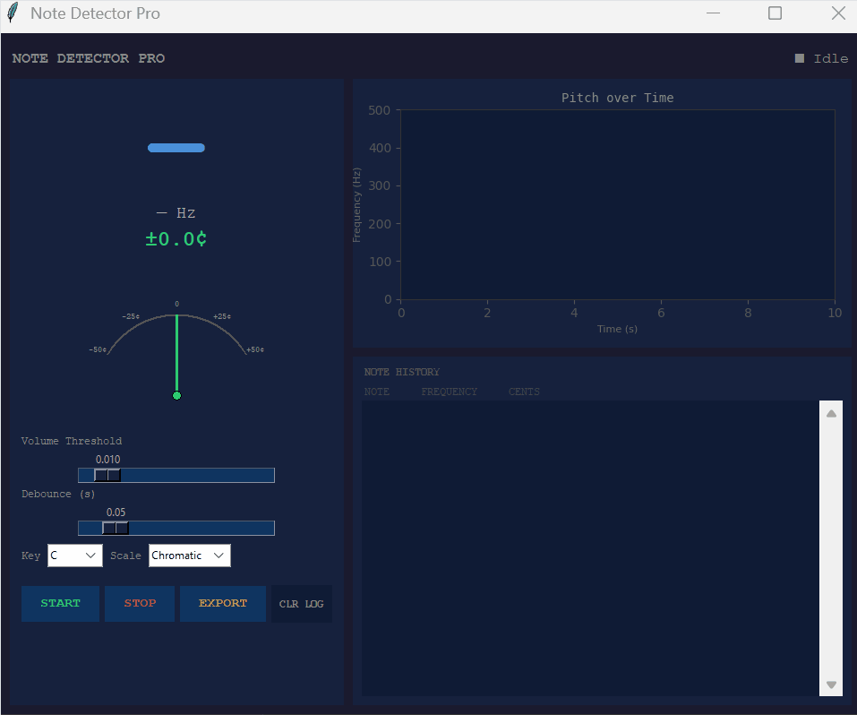

# FreqApp: Real-Time Pitch Detection & Visualization

A high-performance Python application designed for real-time Digital Signal Processing. The tool captures live audio input, identifies musical notes using the YIN algorithm, and visualizes frequency trajectory over time.

## Overview
This project was built to explore software development using peripherals like a microphone.
This project is meant to serve as a stepping stone to build a larger piano learning app.

## Technical Stack
* **Language:** Python
* **Audio Engine:** PyAudio (PortAudio)
* **DSP Library:** Aubio (Implementing the YIN Pitch Tracking Algorithm)
* **Numerical Computing:** NumPy
* **Visualization:** Matplotlib
* **GUI Framework:** Tkinter

## Technical Highlights

### 1. Concurrency & Thread Safety
The application utilizes a dedicated background thread for the audio processing loop to prevent blocking the main GUI thread.
* **Producer-Consumer Logic:** The audio thread captures and processes frames, while the main thread handles UI rendering.
* **Safe Updates:** UI elements are updated via `root.after()` to ensure thread safety within the Tkinter event loop.

### 2. Digital Signal Processing Pipeline

* **Normalization:** Converts raw 16-bit integer PCM data into normalized floating-point buffers (-1.0 to 1.0) using NumPy for high-speed vector operations.
* **YIN Algorithm:** Leverages the YIN algorithm for fundamental frequency detection, which is superior to basic Zero-Crossing methods for handling complex waveforms and background noise.

### 3. Optimized Visualization
* **Rolling Buffer:** Uses `collections.deque` with a fixed length to maintain a sliding window of pitch data. This ensures O(1) time complexity for appending new samples and popping old ones.
* **Matplotlib Integration:** Embeds a dynamic plot directly into the Tkinter canvas, optimized to refresh only the necessary data points rather than redrawing the entire figure.

### AI
* Leveraged AI to explore the aubio library and matplotlib-tinker integration